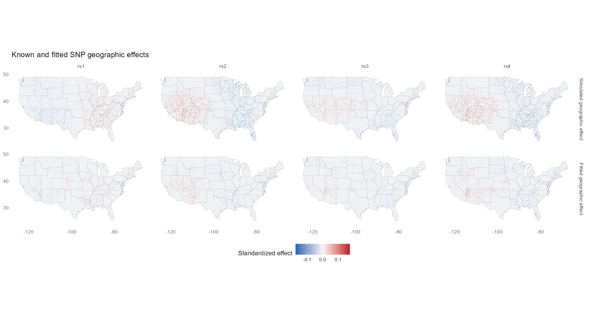
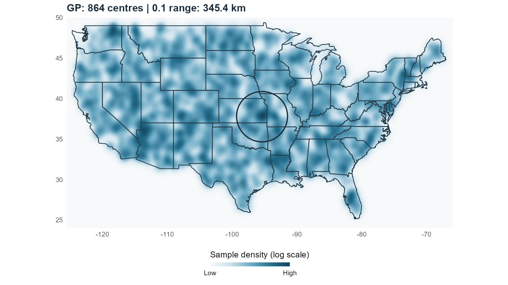

```{r setup, include=FALSE}
knitr::opts_chunk$set(echo = TRUE, eval = FALSE)
```

Spatial genetic principal components from location-aggregated genotypes,
conditional on genetic PCs and other fixed effects. **SPDE is recommended for
large SNP datasets**; the GP workflow is also available below.

This walkthrough goes from an individual table and PLINK BED files to a mesh,
estimated smoothing, mapped spatial PCs and exported results. Figures use
**150,000 synthetic SNPs, 8,953 individuals and 3,000 US locations**. For your
own analysis, replace the input paths and choose scales for your geography.

## Install and load

```{r install}
install.packages(c("remotes", "RTriangle", "sf"))
remotes::install_github("harryyiheyang/spatialGPCA")
library(spatialGPCA)
library(ggplot2)
library(sf)
```

Source installation requires a C++17 compiler and R's BLAS/LAPACK. On Windows,
install the Rtools version for your R installation. Mesh construction uses
RTriangle internally; `sf` projects and buffers the supplied boundary coordinates.

## 1. Prepare the inputs

Your individual table must have **FID, IID, Lat, Lon as its first four columns**.
Lat/Lon are in degrees; every remaining column is a numeric fixed effect.
For example, include genetic PCs, numeric urban/rural indicators and income:

```{r input}
table <- read.delim("individuals.tsv", colClasses = c(FID = "character", IID = "character"))
head(table)
# FID IID Lat Lon GPC1 GPC2 urban income
prefix <- "merged"
```

`prefix` names your prepared `merged.bed`, `merged.bim` and `merged.fam` files.
Use diploid biallelic autosomal SNPs after your usual QC. Generate external
allele frequencies outside R if you do not already have them:

```sh
plink2 --bfile merged --freq --out merged
```

The package matches FID + IID to FAM, keeps the intersection, and restores FAM
order. Shared Lat/Lon pairs define locations. All covariates are averaged at
locations, sample counts supply weights, and an intercept is added automatically.
Categorical covariates must be encoded as numeric indicators.

Frequencies are matched by SNP ID and oriented to the BIM counted allele.
Missing genotypes receive **2f** before location averaging, centering and HWE
scaling. No separate location table or count file is needed.

## 2. Construct the SPDE mesh and inspect its range

Choose the geographic scale separately from mesh resolution. This US example
uses nominal Matérn correlation
exp(-1) at 150 km, giving a **0.1-correlation distance of about 291 km**.
The mesh extends a fixed **50 km** beyond a coarse convex US envelope;
this buffer is independent of the correlation range:

```{r mesh}
scale <- svgpc_spde_scale(distance = 150)
locations <- svgpc_spde_locations(table)
range <- svgpc_spde_scale(1, correlation = .1)$kappa / scale$kappa
buffer <- 50
boundary <- read.delim(system.file("extdata", "us_boundary.tsv", package = "spatialGPCA"))
origin <- locations$projection$origin
crs <- paste0("+proj=aeqd +lat_0=", origin[1], " +lon_0=", origin[2],
               " +R=6371008.8 +units=km")
points <- st_as_sf(boundary, coords = c("Lon", "Lat"), crs = 4326)
hull <- st_convex_hull(st_union(st_transform(points, crs)))
domain <- st_buffer(hull, dist = buffer, joinStyle = "MITRE", mitreLimit = 5)
vertices <- st_coordinates(domain)[, 1:2]
vertices <- vertices[-nrow(vertices), ]
segments <- cbind(seq_len(nrow(vertices)), c(2:nrow(vertices), 1))
mesh <- svgpc_spde_mesh(locations, max_area = 8000, buffer = buffer,
                        vertices = vertices, segments = segments)
mesh
plot(mesh, kappa = scale$kappa)
```


The heatmap shows relative **individual density**, weighted by the number of
people at each coordinate, with log1p-transformed smoothed counts scaled to 0–1.
Small red dots are mesh vertices; thin edges are
triangles. The black circle marks the distance at which the nominal correlation
reaches 0.1, centred at the heatmap peak. No individual points are drawn.

- `max_area`: maximum triangle area in **km²**. Smaller values give a finer mesh
  and increase computation and memory.
- `buffer`: fixed outward offset in **km**, 50 for the US and 5 for the UK.
  It is independent of the correlation range. `st_buffer()` applies this distance;
  with custom vertices, the mesh function records it without applying it again.
- `distance`: the distance in km at which the chosen nominal correlation is
  reached; the default correlation is exp(-1). The helper returns `kappa` in
  inverse km. To set a 300 km **0.1 range** directly, use
  `svgpc_spde_scale(distance = 300, correlation = 0.1)` and pass its kappa to both
  plotting and preparation.

These values illustrate the US example. Change them and redraw before fitting;
inspect node count and coverage. The circle describes nominal prior correlation,
not a hard cutoff or the fitted effect of an individual sample.

The package includes tiny [US and UK boundary coordinate files](inst/extdata/BOUNDARIES.md)
derived from [Natural Earth 1:110m countries](https://www.naturalearthdata.com/downloads/110m-cultural-vectors/110m-admin-0-countries/).
For UK data, replace `us_boundary.tsv` with `uk_boundary.tsv` and set `buffer <- 5`; the same steps
use your locations' projection. The US envelope covers the contiguous 48 states;
the UK envelope uses the 1:10m source to include Shetland and the Isles of Scilly,
then reduces it to a coarse convex envelope. Check your locations' coverage after buffering.
These are coarse convex envelopes,
not coastline masks: they intentionally include intervening sea. A small number
of straight boundary edges avoids forcing tiny triangles around coastal detail.
The map shows the entire buffered mesh. Without custom vertices, the mesh
function still uses its rectangular default.

## 3. Fit all SNPs and estimate smoothing

Pass the selected mesh into preparation; it will retain its nodes and coordinate
frame while matching the table to BED. Accumulate all SNPs, then estimate lambda:

```{r fit}
model <- svgpc_spde_prepare_data(mesh, table, kappa = scale$kappa, bed = prefix)
model <- svgpc_spde_accumulate(model, paste0(prefix, ".afreq"))
parameters <- svgpc_spde_select_lambda(model, method = "REML")
parameters
```

**Assign the returned SPDE model**, as shown. BED is read in 256-SNP blocks by
default, without retaining the full genotype matrix. `"GCV"` is an alternative
to `"REML"`; choose one. Lambda is estimated from genotypes and controls smoothing;
it is distinct from the geographic correlation range chosen above.

## 4. Extract and map spatial PCs

Choose the number of components after selecting lambda:

```{r pcs}
result <- svgpc_spde_fit(model, parameters = parameters, components = 10)
PC <- result$outputs$raw_F_PCA$pcs
if (!ncol(PC)) stop("No nonzero spatial PCs were retained")
colnames(PC) <- paste0("SPC", seq_len(ncol(PC)))
locations <- model$spatial$locations
```

PC rows follow `locations`, not input-table order. Columns are orthonormal
raw-location PC vectors; their signs are arbitrary. The following plots the
first four available PCs on a US map. Each panel is scaled for colour display
only. A zero-column result means the fit retained no nonzero spatial components:

```{r pc-map}
outline <- map_data("state")
score <- PC[, seq_len(min(4, ncol(PC))), drop = FALSE]
score <- sweep(score, 2, apply(abs(score), 2, max), "/")
dat <- data.frame(Lon = rep(locations$Lon, ncol(score)), Lat = rep(locations$Lat, ncol(score)),
                  component = rep(colnames(score), each = nrow(PC)),
                  score = as.vector(score))
ggplot() +
    geom_polygon(data = outline, aes(long, lat, group = group),
                 fill = "#F1F3F5", colour = "#B3BDC5", linewidth = .15) +
    geom_point(data = dat, aes(Lon, Lat, colour = score), size = .55) +
    scale_colour_gradient2(low = "#2166AC", mid = "#F7F7F7", high = "#B2182B",
                           limits = c(-1, 1), name = "Relative score") +
    facet_wrap(~component, ncol = 2) + coord_quickmap() +
    theme_minimal() + theme(panel.grid = element_blank(), legend.position = "bottom")
```


Use a map outline for your region outside the US. To request more PCs, reuse
`model` and `parameters`; this neither rereads BED nor re-estimates lambda:

```{r more-pcs}
result20 <- svgpc_spde_fit(model, parameters = parameters, components = 20)
```

## 5. Export and resume

Export location PCs, or map each retained individual's location back to its PC
scores using the package's stored matching order:

```{r export}
write.table(cbind(locations[, c("Lat", "Lon", "count")], PC), "location_pcs.tsv",
            sep = "\t", quote = FALSE, row.names = FALSE)
individual_PC <- cbind(model$spatial$table[, c("FID", "IID")],
                       PC[model$spatial$sample_location, , drop = FALSE])
write.table(individual_PC, "individual_pcs.tsv", sep = "\t", quote = FALSE, row.names = FALSE)
```

Save the model with its selected parameters to continue in another R session:

```{r save}
saveRDS(list(model = model, parameters = parameters), "spatial_model.rds")
saved <- readRDS("spatial_model.rds")
result <- svgpc_spde_fit(saved$model, parameters = saved$parameters, components = 10)
```

Changing the mesh or `kappa` requires preparation, accumulation and lambda
selection again. Changing only `components` reuses the existing statistics.

## Optional: geographic effects for selected SNPs

For a small set of SNPs, supply `Y`: their standardized location means, with
rows in `model$spatial$locations` order and the same 2f imputation, centering and
HWE scaling used during fitting. This step requires constructing `Y` separately;
the [complete US example](inst/examples/us_full_fit.Rmd) shows how to retain and
standardize selected genotypes. Once `Y` is available, reuse the selected lambda:

```{r effects}
Fhat <- svgpc_spde_fitted(model, Y, lambda = parameters$lambda)
```

`Fhat` contains geographic contributions, excluding fixed effects. The US
simulation below compares four SNPs selected before fitting with their known
geographic effects; a common colour scale keeps amplitude shrinkage visible.



## GP alternative

GP uses geographic cluster centres and an exponential kernel. Its `rho` is the
e-folding distance, so **the displayed 0.1 range is `rho * log(10)`**. At
`rho = 150`, the circle radius is about 345 km. To set a desired radius r,
use `rho = r / log(10)`:

```{r gp-geography}
cls <- svgpc_cluster(table, rho = 150, clusters = 1000)
plot(cls)
```



`clusters` is the initial centre count; empty and small classes are merged.
Small red dots show the retained centres. Both GP and mesh plots contain one
map, with the same density colours and 0.1-range circle convention.

```{r gp-fit}
gp <- svgpc_prepare(cls, bed = prefix)
svgpc_accumulate(gp, paste0(prefix, ".afreq"))
gp_parameters <- svgpc_select_lambda(gp, method = "REML")
gp_result <- svgpc_fit(gp, parameters = gp_parameters, components = 10)
gp_PC <- gp_result$outputs$raw_F_PCA$pcs
gp_locations <- gp_result$spatial$locations
```

GP accumulation updates its model in place. Use `svgpc_save(gp, "gp_model.rds")`
and `svgpc_load("gp_model.rds")` for its native cache. Updating `cls$rho` changes
its displayed circle; to fit a different range, repeat preparation onward.

## GP and SPDE comparison

Both analyses use the same 150,000 synthetic SNPs, 8,953 individuals and 3,000
locations. The SPDE column is the new convex-boundary run shown above; the GP
column is the completed reference run on the identical genotype and frequency
files. Data generation and plotting are excluded from analysis time.

| Measurement | GP reference | SPDE, convex boundary |
| --- | ---: | ---: |
| BED accumulation | 198.78 s | **24.64 s** |
| Total analysis | 202.67 s | **27.31 s** |
| Spatial-subspace canonical correlation 1 | 0.9840 | 0.9844 |
| Spatial-subspace canonical correlation 2 | 0.9717 | 0.9737 |
| Spatial-subspace canonical correlation 3 | 0.9307 | 0.9377 |

SPDE reduced total analysis time by **86.5%** in these runs. Canonical
correlations near 1 indicate recovery of the three planted spatial directions,
allowing arbitrary PC signs and rotations. Recovery is similar here; this is
one simulation, not evidence that either method is universally more accurate.
GP uses rho = 135.853 km; the SPDE example matches exp(-1) at 150 km and uses
1,213 mesh vertices with a fixed 50 km buffer. Their covariance models and settings differ. See
[timings, settings and earlier comparison](inst/doc/PERFORMANCE.md).

## Reproduce the US example

The [complete runnable example](inst/examples/us_full_fit.Rmd) generates the
synthetic individual table, BED and frequency files, then performs the SPDE
analysis and the PC/effect plots shown above. From a source checkout, install
`knitr` and `rmarkdown`, make Pandoc available (included with RStudio), and run:

```sh
Rscript tools/build_rmd.R inst/examples/us_full_fit.Rmd inst/doc
```

For real data, start with your existing files at step 1. A separate local
simulation data file is generated only when running the full example. The
package does not include the large BED or individual TSV; the bundled synthetic
test fixture is about 0.44 MB. `individuals.tsv` above is your input, and the
PC TSV files are outputs created by your analysis.

[SPDE reference](inst/doc/SPDE.md) · [GP workflow](inst/doc/WORKFLOW.md) ·
[GP mathematics](inst/doc/MATHEMATICS.md)

Yihe Yang. Licensed under [GPL-3](inst/COPYING).
