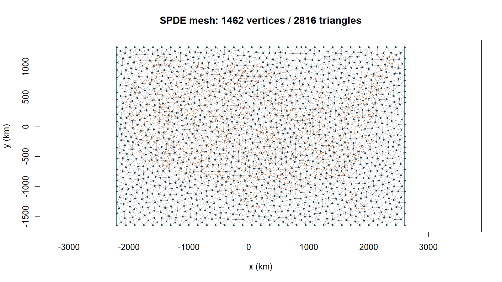
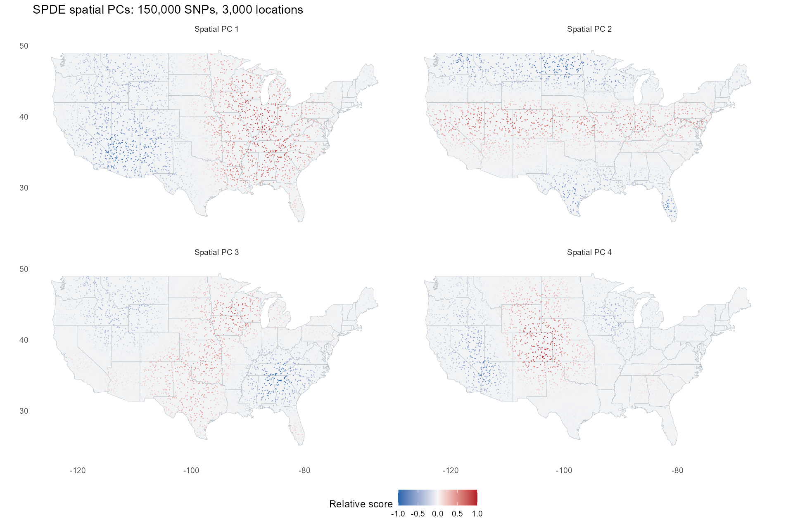

spatialGPCA
================

Spatial genetic principal components from location-aggregated genotypes,
conditional on fixed effects. **SPDE is the recommended starting point
for large SNP datasets.** It uses a triangular finite-element mesh and
sparse genotype projection. The GP alternative is described below.

## Installation

``` r
install.packages(c("remotes", "RTriangle"))
remotes::install_github("harryyiheyang/spatialGPCA")
library(spatialGPCA)
```

Source installation requires a C++17 compiler and R’s BLAS/LAPACK; on
Windows, install the Rtools version for your R installation. RTriangle
constructs meshes.

## Inputs

Supply an individual table with **FID, IID, Lat, Lon as the first four
columns**; Lat/Lon are in degrees. Every remaining column is a numeric
fixed effect:

``` r
table <- read.delim("individuals.tsv", colClasses = c(FID = "character", IID = "character"))
# FID IID Lat Lon GPC1 GPC2 urban income
```

The package matches FID + IID to FAM, keeps their intersection and
orders by FAM. Shared coordinates define locations. Covariates are
averaged at locations, sample counts become weights, and an intercept is
added. Encode categorical covariates as numeric indicators.

Use a prepared BED/BIM/FAM fileset of diploid biallelic autosomal SNPs
and external allele frequencies. For a fileset named `merged`, generate
frequencies with:

``` sh
plink2 --bfile merged --freq --out merged
```

Frequencies are matched by SNP ID and oriented to the BIM counted
allele. Missing genotypes receive **2f** before location averaging and
standardization.

## SPDE: recommended workflow

### 1. Construct and inspect the mesh

``` r
locations <- svgpc_spde_locations(table)
mesh <- svgpc_spde_mesh(locations, max_area = 8000, buffer = 150)
plot(mesh)
```

`max_area` is the maximum triangle area in km²; smaller values give a
finer mesh. `buffer` extends the study’s bounding rectangle in km. These
example values are for the US simulation below. Inspect the node count
and mesh coverage before fitting. Construction uses RTriangle inside the
package; no GP clustering is needed.

<figure>

<figcaption aria-hidden="true">SPDE mesh and synthetic US observation
locations</figcaption>
</figure>

### 2. Accumulate SNPs and estimate smoothing

``` r
scale <- svgpc_spde_scale(distance = 150)
model <- svgpc_spde_prepare_data(mesh, table, kappa = scale$kappa, bed = "merged")
model <- svgpc_spde_accumulate(model, "merged.afreq")
parameters <- svgpc_spde_select_lambda(model, method = "REML")
```

Here `distance = 150` means nominal Matérn correlation exp(-1) at 150
km; the helper returns `kappa` in inverse km. Choose this geographic
scale for your study, separately from mesh resolution. Lambda controls
smoothing and is estimated from all SNPs; `"GCV"` is an alternative to
`"REML"`. **Assign the accumulated model** as shown. SNPs are read in
blocks without retaining the full genotype matrix.

### 3. Choose the number of PCs

``` r
result <- svgpc_spde_fit(model, parameters = parameters, components = 10)
PC <- result$outputs$raw_F_PCA$pcs
locations <- model$spatial$locations
```

PC rows correspond to `locations`; columns are orthonormal raw-location
PC vectors. Change `components` and repeat the fit to obtain more PCs
without rereading BED or re-estimating lambda. To resume later, save
both the model and selected parameters:

``` r
saveRDS(list(model = model, parameters = parameters), "spatial_model.rds")
```

## US example and measured runtime

The [complete US example](inst/examples/us_full_fit.Rmd) simulates
**150,000 SNPs at 3,000 locations**, constructs its mesh using
`svgpc_spde_mesh()`, and fits SPDE through the public package functions.
Coordinates and genotypes are synthetic.

<figure>

<figcaption aria-hidden="true">SPDE spatial PCs at synthetic US
locations</figcaption>
</figure>

On the same synthetic BED, a local benchmark measured **27.36 seconds**
for SPDE accumulation and **30.18 seconds** for preparation,
accumulation, REML and 10 PCs: **86% less accumulation time and 85% less
analysis time** than the GP comparison. Large meshes still incur dense
preparation/PCA costs, and the methods use different covariance models.
See [benchmark setup and limits](inst/doc/PERFORMANCE.md).

To render the example from a source checkout, install `knitr` and
`rmarkdown`, make Pandoc available (included with RStudio), and run:

``` sh
Rscript tools/build_rmd.R inst/examples/us_full_fit.Rmd inst/doc
```

The example generates its BED and frequency files. Use your existing
files for real data. `Rscript tools/build_rmd.R` rebuilds this README
from `README.Rmd`.

## GP alternative

Use GP when you want the existing exponential-kernel model and
geographic cluster centres. `rho` is its distance scale in km;
`clusters` is the initial centre count. Empty and small classes are
merged automatically.

``` r
cls <- svgpc_cluster(table, rho = 150, clusters = 1000)
plot(cls)
model <- svgpc_prepare(cls, bed = "merged")
svgpc_accumulate(model, "merged.afreq")
parameters <- svgpc_select_lambda(model, method = "REML")
result <- svgpc_fit(model, parameters = parameters, components = 10)
```

GP accumulation updates its model in place. Use `svgpc_save()` /
`svgpc_load()` for GP model caches; SPDE models use `saveRDS()` /
`readRDS()`.

## Further documentation

[SPDE model and advanced options](inst/doc/SPDE.md) · [GP
workflow](inst/doc/WORKFLOW.md) · [GP
mathematics](inst/doc/MATHEMATICS.md)

Yihe Yang. Licensed under [GPL-3](inst/COPYING).
